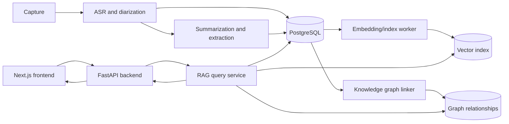
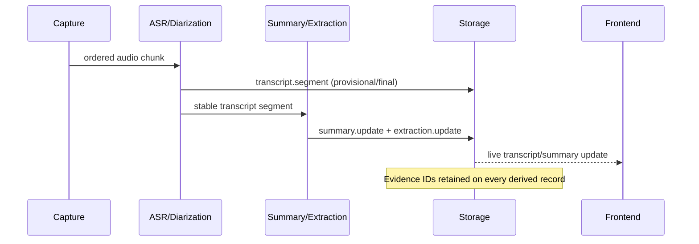
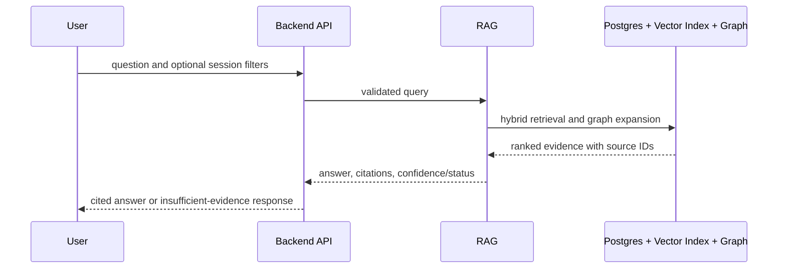

"""
Week 03 (24-08-2026 - 30-08-2026)
Task: Draft architecture docs and component diagrams

Why this matters:
The Week 2 boundaries need a single visual representation that the team and
faculty can use to check data ownership and evidence flow. These diagrams
become the reference for API alignment in Week 4 and architecture sign-off in
Week 5.

What this script does:
This design note documents the component, live-update, and historical-query
flows in Mermaid diagrams with the assumptions used for early mock work.
"""

# Week 3 — architecture documentation and diagrams

## Component diagram

## Live meeting update flow

## Historical question flow

## Storage model at this stage

PostgreSQL stores sessions, transcript segments, summary versions, extracted
records, and citation provenance. The vector index stores embeddings for
searchable records and references their canonical IDs. The graph stores
relationships such as `PERSON MENTIONED_IN SESSION`, `ACTION_ITEM OWNED_BY
PERSON`, and `DECISION SUPPORTED_BY SEGMENT`. It does not become an alternate
copy of raw transcript data.

## Assumptions for early fixtures

- Audio, ASR, and LLM providers are swappable adapters, not architecture
  dependencies.
- Speaker labels may be anonymous (for example, `SPEAKER_00`) until identity
  resolution is available.
- Search and answer generation must return an explicit insufficient-evidence
  result instead of inventing a response.

## WEEK OUTPUT CONTRACT

**Input:** Week 2 service and payload boundaries.

**Output:** Reusable component and sequence diagrams plus a storage-role
statement. The diagrams describe the expected chain for the eventual weekly
integration demo.
