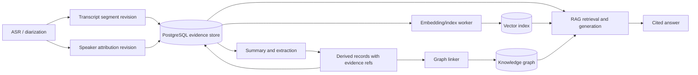
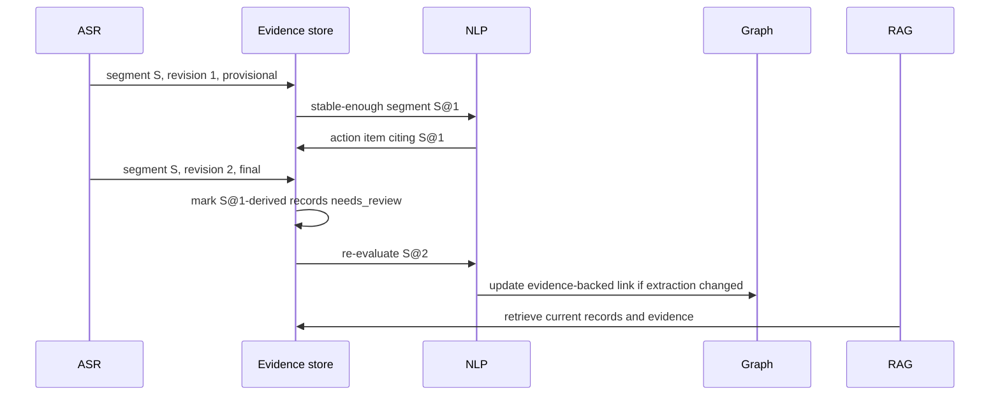

"""
Week 09 (05-10-2026 - 11-10-2026)
Task: Update architecture docs to reflect the revised design

Why this matters:
The Week 8 model changes how provisional transcript data becomes stable
evidence. Updating the architecture prevents later services from using an
outdated assumption that transcript segments or speaker labels are immutable.

What this script does:
This design note updates the component and event flow to include revisions,
speaker-attribution records, and dependent-record re-evaluation.
"""

# Week 9 — revised architecture reference

## Revised evidence flow

## Revision event flow

## Updated responsibilities

| Component | New/clarified responsibility |
| --- | --- |
| ASR/diarization | Emits revision/finality information; keeps speaker labels separate from identities |
| Storage | Maintains immutable evidence history and identifies dependent records requiring review |
| NLP | Creates provenance-bearing records and re-evaluates invalidated records |
| Graph | Links only evidence-supported records; never treats a local speaker label as global identity |
| RAG | Prefers active/current evidence and indicates incomplete/low-confidence support when appropriate |

## Unchanged architecture decisions

PostgreSQL remains the canonical evidence store, vector search remains a
derived retrieval mechanism, the graph remains lightweight and explainable,
and public clients continue to use the versioned backend API. The revised
model changes data semantics, not the chosen service topology.

## WEEK OUTPUT CONTRACT

**Input:** The Week 8 diarization-aware model and the Week 2 service contract.

**Output:** The revised architecture diagram and event sequence that all
future schema, graph, and RAG work must follow.
